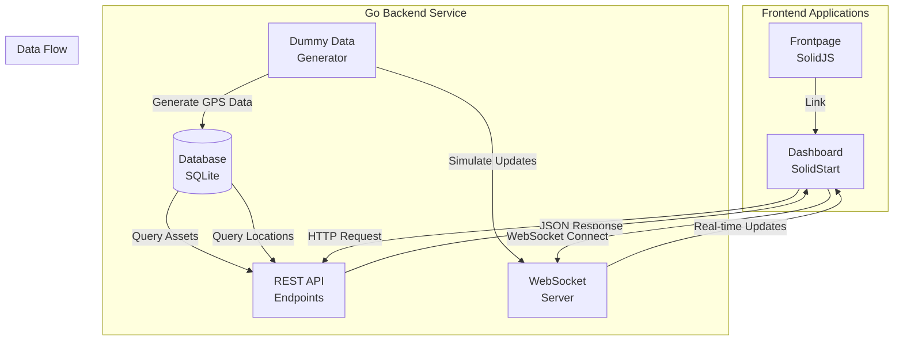

# Logistics Tracker Platform - POC Dashboard Specification

## Executive Summary

This document specifies the Proof of Concept (POC) dashboard for the Logistics Tracker Platform. The POC is designed to demonstrate core platform capabilities to potential clients and stakeholders, focusing on real-time GPS tracking, asset management, and location visualization.

**Primary Objective**: Create a polished, functional demonstration dashboard that showcases the platform's ability to track logistics assets in real-time across Southeast Asia.

**Scope**: GPS data only (per MVP restrictions), operations dashboard with basic tracking features.

**Timeline**: 4 weeks for complete POC implementation.

**Success Criteria**:
- All core screens functional and polished
- Smooth map interactions with real-time updates
- Realistic dummy data with Southeast Asia locations
- Professional UI appearance suitable for client demonstrations
- Responsive design for desktop and tablet
- Performance: <3s initial load, smooth map panning/zooming

---

## 1. POC Goals & Scope

### 1.1 Primary Goals

1. **Demonstrate Platform Capabilities**
   - Show real-time GPS tracking functionality
   - Display asset management capabilities
   - Visualize location history and routes
   - Demonstrate real-time data updates via WebSocket

2. **Validate Technical Approach**
   - Test SolidJS/SolidStart framework suitability
   - Validate Go backend architecture
   - Verify real-time update performance
   - Test map integration and performance

3. **Gather Stakeholder Feedback**
   - Collect user experience feedback
   - Identify feature priorities
   - Understand user workflow needs
   - Refine UI/UX based on demonstrations

### 1.2 In-Scope Features

- **Real-Time GPS Tracking**
  - Live map view with asset markers
  - Real-time location updates via WebSocket
  - Asset clustering for performance
  - Interactive map controls

- **Asset Management**
  - View all assets in list format
  - Filter and search assets
  - View individual asset details
  - Basic asset manipulation (create, edit, delete)

- **Location History Visualization**
  - Display route trails on map
  - Show location history timeline
  - Speed and telemetry charts
  - Historical replay functionality

- **Basic Geofencing** (Visualization Only)
  - Display geofence boundaries on map
  - Show geofence entry/exit events
  - Geofence list and management UI

- **Frontpage**
  - Marketing/landing page
  - Platform overview and features
  - Call-to-action to dashboard

### 1.3 Out-of-Scope Features

- **Video/Audio Streaming**: GPS data only per MVP restrictions
- **Complex Analytics**: Basic charts only
- **Multi-Tenant Features**: Single tenant for POC
- **Production-Grade Security**: Simplified authentication for POC
- **Advanced Reporting**: Basic data export only
- **Mobile Applications**: Web dashboard only

---

## 2. Frontpage Specification

### 2.1 Landing Page (SolidJS)

**Purpose**: Marketing and introduction page for the Logistics Tracker Platform.

**Technology**: SolidJS static site with Tailwind CSS.

**Layout**: Single-page application with smooth scrolling sections.

#### 2.1.1 Hero Section

- **Content**:
  - Platform name and tagline
  - Value proposition: "Unified Logistics Tracking Platform"
  - Primary CTA button: "View Dashboard" or "Get Started"
  - Background: Subtle logistics-themed imagery or gradient

- **Design**:
  - Full-width section
  - Centered content
  - Modern, professional aesthetic
  - Use defined daisy UI light and dark palette

#### 2.1.2 Features Overview

- **Sections**:
  - Real-Time Tracking
  - Multi-Source Data Integration
  - Advanced Analytics
  - Enterprise-Grade Security

- **Layout**: 2x2 or 3-column grid with icons and descriptions

#### 2.1.3 Use Cases

- **Examples**:
  - Fleet Management
  - Supply Chain Visibility
  - Last-Mile Delivery Tracking
  - Multi-Partner Logistics Coordination

#### 2.1.4 Call-to-Action

- **Primary CTA**: Link to dashboard application
- **Secondary CTA**: Contact/Request Demo button

#### 2.1.5 Footer

- **Content**:
  - Company information
  - Contact details
  - Links to dashboard
  - Copyright notice

---

## 3. Dashboard Screens Specification

### 3.1 Main Dashboard / Map View

**Route**: `/dashboard` (SolidStart route)  
**Purpose**: Real-time fleet overview with interactive map

#### 3.1.1 Layout Structure

```
┌─────────────────────────────────────────────────────────┐
│  Header: Logo | Navigation | User Menu                   │
├──────────┬──────────────────────────────────────────────┤
│          │                                              │
│ Asset    │           Interactive Map                    │
│ List     │           (Full Screen)                      │
│ Panel    │                                              │
│          │           [Asset Markers]                    │
│          │           [Route Trails]                      │
│          │           [Geofences]                        │
│          │                                              │
│          │  [Map Controls: Zoom, Pan, Layers]          │
├──────────┴──────────────────────────────────────────────┤
│  Stats Panel: Total Assets | Active | Alerts           │
└─────────────────────────────────────────────────────────┘
```

#### 3.1.2 Components

**Interactive Map**:
- **Library**: Mapbox GL JS with SolidJS bindings
- **Initial View**: Centered on Southeast Asia region
  - Center: `[103.8198, 1.3521]` (Singapore)
  - Zoom Level: 6-7 (shows entire SEA region)
- **Base Map**: add in Light & Dark theme
- **Features**:
  - Asset markers with custom icons
  - Marker clustering for performance
  - Location history trails (polylines)
  - Geofence boundaries (polygons)
  - Map controls (zoom, pan, fullscreen, layers)

**Asset List Panel** (Collapsible Sidebar):
- **Position**: Left side, collapsible
- **Content**:
  - Search bar
  - Status filters (All, Active, Inactive, Moving, Stopped)
  - Scrollable list of assets
  - Each item shows: Icon, Name, Status, Last Location
- **Interactions**:
  - Click asset to center map and show details
  - Hover to highlight on map
  - Filter by status or search

**Quick Stats Panel**:
- **Position**: Bottom bar or top header
- **Metrics**:
  - Total Assets: `X`
  - Active Assets: `Y`
  - Moving Assets: `Z`
  - Alerts: `N`
- **Design**: Card-based layout with icons

**Time Controls**:
- **Position**: Top-right of map or header
- **Features**:
  - Live mode toggle (ON/OFF)
  - Historical replay controls (if implemented)
  - Current time display

#### 3.1.3 Interactions

- **Map Marker Click**: Show asset details popup/sidebar
- **Asset List Click**: Center map on asset, show details
- **Map Drag/Pan**: Update view
- **Zoom**: Adjust marker clustering
- **Filter Change**: Update visible markers
- **Search**: Filter and highlight matching assets

#### 3.1.4 Real-Time Updates

- **WebSocket Connection**: Connect to Go backend WebSocket endpoint
- **Update Frequency**: Every 1-5 seconds for active assets
- **Update Behavior**: Smooth marker movement, no flickering
- **Connection Status**: Indicator showing connection state

---

### 3.2 Asset List View

**Route**: `/assets` (SolidStart route)  
**Purpose**: Comprehensive list view of all assets with filtering and management

#### 3.2.1 Layout Structure

```
┌─────────────────────────────────────────────────────────┐
│  Header: Assets | [Add Asset Button]                    │
├─────────────────────────────────────────────────────────┤
│  Filters: [Status] [Type] [Search...] [Date Range]     │
├─────────────────────────────────────────────────────────┤
│  ID      │ Name    │ Type │ Status │ Location │ Speed │
├──────────┼─────────┼──────┼────────┼──────────┼───────┤
│ TRUCK-01│ Delivery│ Truck│ Active │ Singapore│ 45 km/h│
│ VAN-02  │ Express │ Van  │ Moving │ KL       │ 60 km/h│
│ ...     │ ...     │ ...  │ ...    │ ...      │ ...    │
└─────────────────────────────────────────────────────────┘
```

#### 3.2.2 Components

**Data Table**:
- **Columns**:
  - ID (sortable)
  - Name (sortable, searchable)
  - Type (filterable: Truck, Van, Motorcycle, Ship, Aircraft)
  - Status (filterable: Active, Inactive, Maintenance)
  - Last Location (city/address)
  - Last Update (relative time: "2 min ago")
  - Speed (current speed in km/h)
  - Actions (View, Edit, Delete icons)

**Filters Panel**:
- **Status Filter**: Dropdown (All, Active, Inactive, Moving, Stopped)
- **Type Filter**: Multi-select checkboxes
- **Search Bar**: Full-text search by name/ID
- **Date Range**: Optional filter for last update

**Actions**:
- **Add Asset**: Button to create new asset
- **Bulk Actions**: Select multiple, export, delete
- **Export**: Download CSV/JSON of filtered results

#### 3.2.3 Features

- **Sorting**: Click column headers to sort
- **Pagination**: 20-50 items per page
- **Row Click**: Navigate to asset detail view
- **Real-Time Updates**: Table updates via WebSocket
- **Status Indicators**: Color-coded badges (Green=Active, Yellow=Stopped, Red=Alert, Gray=Inactive)

---

### 3.3 Asset Detail View

**Route**: `/assets/{id}` (SolidStart dynamic route)  
**Purpose**: Comprehensive view of a single asset with map, details, and history

#### 3.3.1 Layout Structure

```
┌─────────────────────────────────────────────────────────┐
│  Header: Asset Name | Status Badge | [Edit] [Delete]     │
├──────────┬──────────────────────────────────────────────┤
│          │                                              │
│ Details  │           Focused Map View                   │
│ Panel    │           (Asset Location)                   │
│          │                                              │
│ Location │           [Current Marker]                  │
│ Info     │           [Route Trail]                     │
│          │           [Geofences]                        │
│          │                                              │
│ Telemetry│                                              │
│ Chart    │                                              │
│          │                                              │
│ Events   │                                              │
│ Timeline │                                              │
└──────────┴──────────────────────────────────────────────┘
```

#### 3.3.2 Components

**Header Section**:
- Asset name and ID
- Status badge (color-coded)
- Last update timestamp
- Quick actions (Edit, Delete, Export)

**Map Section** (Left/Right Split):
- **Focused Map View**:
  - Centered on asset's current location
  - Current location marker (prominent)
  - Location history trail (colored polyline)
  - Nearby geofences (if any)
  - Route visualization (if route assigned)

**Location Information Panel**:
- **Current Location**:
  - Coordinates (latitude, longitude)
  - Address (reverse geocoded)
  - Accuracy (meters)
- **Movement Data**:
  - Current speed (km/h)
  - Heading (degrees, compass direction)
  - Altitude (if available)
- **Status**:
  - Online/Offline indicator
  - Last update time (relative and absolute)

**Telemetry Panel**:
- **Speed Chart**: Line chart showing speed over time (last 24 hours)
- **Metrics Cards**:
  - Average speed
  - Max speed
  - Distance traveled (today)
  - Total distance

**Events Timeline**:
- **Chronological List**:
  - Geofence entries/exits
  - Speed changes
  - Status changes
  - Location updates (condensed)
- **Features**:
  - Filter by event type
  - Click event to show on map
  - Export events

**Route Information** (If Available):
- Planned route (origin → destination)
- Actual route (current path)
- Progress percentage
- Estimated arrival time
- Deviation analysis

#### 3.3.3 Features

- **Real-Time Updates**: Location and status update automatically
- **Historical Replay**: Playback location history (if implemented)
- **Export Data**: Download location history as CSV/JSON
- **Edit Asset**: Modify asset details
- **Delete Asset**: Remove asset with confirmation

---

## 4. UI/UX Design Specifications

### 4.1 Design System

#### 4.1.1 Color Palette

- Use daisy UI themes
- Allow selecting light and dark theme

#### 4.1.2 Typography

- **Font Family**: System fonts stack or Inter/Roboto
  - `font-family: -apple-system, BlinkMacSystemFont, 'Segoe UI', Roboto, 'Helvetica Neue', Arial, sans-serif;`
- **Headings**:
  - H1: `2.5rem` (40px), Bold
  - H2: `2rem` (32px), Bold
  - H3: `1.5rem` (24px), Semi-bold
  - H4: `1.25rem` (20px), Semi-bold
- **Body Text**:
  - Default: `1rem` (16px), Regular
  - Small: `0.875rem` (14px), Regular
  - Large: `1.125rem` (18px), Regular

#### 4.1.3 Components

- Use Daisy UI components
- Use Daisy UI preset light and dark palette for light and dark modes respectively
- Standardise components / palettes so that we can reuse them efficiently

#### 4.1.4 Responsive Design

- **Desktop**: Full layout with sidebars
- **Tablet**: Collapsible sidebars, adjusted spacing
- **Mobile**: Stacked layout (future consideration)

**Breakpoints**:
- Desktop: `≥1024px`
- Tablet: `768px - 1023px`
- Mobile: `<768px` (not priority for POC)

### 4.2 Map Styling

#### 4.2.1 Base Map

- **Style**: Follow site Light/ Dark theme (Mapbox)
- **Features**: Roads, labels, water bodies
- **Customization**: Subtle colors, high contrast for markers

#### 4.2.2 Asset Markers

**Custom SVG Icons**:
- **Truck**: Blue truck icon
- **Van**: Green van icon
- **Motorcycle**: Orange motorcycle icon
- **Ship**: Navy ship icon
- **Aircraft**: Purple aircraft icon

**Status Colors** (Border/Background):
- **Active/Moving**: Green (`#10B981`)
- **Stopped**: Yellow (`#F59E0B`)
- **Alert/Issue**: Red (`#EF4444`)
- **Inactive/Offline**: Gray (`#6B7280`)

**Marker Behavior**:
- Hover: Scale up slightly, show tooltip
- Click: Show details popup/sidebar
- Clustering: Show count badge on cluster

#### 4.2.3 Route Trails

- **Color**: Blue (`#2563EB`) with gradient
- **Width**: 3-5px
- **Opacity**: 0.7
- **Style**: Smooth curves between points

#### 4.2.4 Geofences

- **Fill Color**: Light blue (`rgba(37, 99, 235, 0.1)`)
- **Border Color**: Blue (`#2563EB`)
- **Border Width**: 2px
- **Border Style**: Dashed
- **Label**: Geofence name on hover/click

### 4.3 Data Visualization

#### 4.3.1 Charts

**Speed Chart** (Line Chart):
- **Library**: Chart.js with SolidJS wrapper
- **X-Axis**: Time (last 24 hours)
- **Y-Axis**: Speed (km/h)
- **Line Color**: Blue (`#2563EB`)
- **Area Fill**: Light blue gradient
- **Grid**: Subtle gray lines

**Metrics Cards**:
- **Layout**: 2x2 or 4-column grid
- **Design**: White card with icon, value, label
- **Icons**: Simple SVG icons

#### 4.3.2 Status Indicators

- **Badges**: Color-coded pills
- **Icons**: Status-specific icons (checkmark, warning, error)
- **Tooltips**: Hover to show detailed status

#### 4.3.3 Timestamps

- **Display**: Relative time ("2 minutes ago")
- **Hover**: Show absolute time ("2024-01-15 10:30:00 UTC")
- **Format**: ISO 8601 for API, human-readable for UI

---

## 5. Technology Stack

### 5.1 Frontend

#### 5.1.1 Frontpage (SolidJS)

- **Framework**: SolidJS
- **Components**: DaisyUI
- **Build Tool**: Vite
- **Styling**: Tailwind CSS
- **Deployment**: Static site (can be hosted on any static host)

**Key Dependencies**:
```json
{
  "solid-js": "^1.8.0",
  "solid-js": "^1.8.0",
  "vite": "^5.0.0",
  "vite-plugin-solid": "^2.8.0",
  "tailwindcss": "^3.4.0"
}
```

#### 5.1.2 Dashboard (SolidStart)

- **Framework**: SolidStart (full-stack SolidJS framework)
- **Build Tool**: Vite (built into SolidStart)
- **Routing**: File-based routing (`src/routes/`)
- **State Management**: SolidJS signals (built-in reactivity)
- **Styling**: Tailwind CSS or CSS Modules
- **Maps**: Mapbox GL JS or Leaflet with SolidJS bindings
- **Charts**: Chart.js or Recharts (with SolidJS wrappers)

**Key Dependencies**:
```json
{
  "solid-start": "^0.4.0",
  "daisy-ui": "^5.5.14",
  "@mapbox/mapbox-gl-js": "^3.0.0",
  "chart.js": "^4.4.0",
  "tailwindcss": "^4.0"
}
```

**SolidJS Map Integration**:
- Use `solid-mapbox`
- Leverage SolidJS reactivity for marker updates

**SolidJS Chart Integration**:
- Use `solid-chartjs` or create wrapper for Chart.js
- Reactive data updates using signals

### 5.2 Backend

#### 5.2.1 Go Monolithic Service

- **Language**: Go 1.21+
- **Framework**: Standard library or lightweight framework
  - Option 1: Standard `net/http` with `gorilla/mux`
  - Option 2: Gin (`github.com/gin-gonic/gin`)
  - Option 3: Echo (`github.com/labstack/echo`)
  - Option 4: Fiber (`github.com/gofiber/fiber`)

**Recommended**: Gin (popular, well-documented, good performance)

**Project Structure**:
```
backend/
├── cmd/
│   └── server/
│       └── main.go          # Application entry point
├── internal/
│   ├── api/
│   │   ├── handlers.go      # HTTP handlers
│   │   └── routes.go        # Route definitions
│   ├── models/
│   │   ├── asset.go         # Asset model
│   │   └── location.go      # Location model
│   ├── services/
│   │   ├── asset_service.go
│   │   └── location_service.go
│   └── websocket/
│       └── hub.go            # WebSocket hub
├── pkg/
│   └── dummy/               # Dummy data generator
│       └── generator.go
├── go.mod
└── go.sum
```

**Key Dependencies**:
```go
require (
    github.com/gin-gonic/gin v1.9.1
    github.com/gorilla/websocket v1.5.1
    github.com/lib/pq v1.10.9  // PostgreSQL (if used)
    // or
    github.com/mattn/go-sqlite3 v1.14.18  // SQLite (for POC)
)
```

#### 5.2.2 API Endpoints

**REST API**:
- `GET /api/assets` - List all assets
- `GET /api/assets/{id}` - Get asset details
- `POST /api/assets` - Create new asset
- `PUT /api/assets/{id}` - Update asset
- `DELETE /api/assets/{id}` - Delete asset
- `GET /api/assets/{id}/locations` - Get location history
- `POST /api/assets/{id}/locations` - Add location update (for dummy data)

**WebSocket**:
- `WS /ws` - WebSocket endpoint for real-time updates
  - Subscribe to asset updates
  - Receive location updates
  - Connection management

**CORS**: Enable CORS for frontend origin

### 5.3 Database

**Options for POC**:

1. **In-Memory** (Simplest for POC):
   - Use Go maps/slices
   - Data lost on restart
   - Fastest to implement

2. **SQLite** (Recommended for POC):
   - File-based database
   - No server setup required
   - Persistent data
   - Easy to reset/seed

3. **PostgreSQL** (If needed):
   - Full-featured database
   - Better for production-like testing
   - Requires database server

**Recommended**: SQLite for POC (easy setup, persistent, sufficient)

**Schema** (SQLite Example):
```sql
CREATE TABLE assets (
    id TEXT PRIMARY KEY,
    name TEXT NOT NULL,
    type TEXT NOT NULL,
    status TEXT NOT NULL,
    created_at TIMESTAMP DEFAULT CURRENT_TIMESTAMP,
    updated_at TIMESTAMP DEFAULT CURRENT_TIMESTAMP
);

CREATE TABLE locations (
    id INTEGER PRIMARY KEY AUTOINCREMENT,
    asset_id TEXT NOT NULL,
    latitude REAL NOT NULL,
    longitude REAL NOT NULL,
    address TEXT,
    speed REAL,
    heading REAL,
    accuracy REAL,
    timestamp TIMESTAMP NOT NULL,
    FOREIGN KEY (asset_id) REFERENCES assets(id)
);

CREATE INDEX idx_locations_asset_timestamp ON locations(asset_id, timestamp);
```

### 5.4 Dummy Data Generator

**Go Service**:
- Generate realistic GPS data for Southeast Asia
- Simulate asset movement between cities
- Create location history with timestamps
- Update locations periodically (for real-time simulation)

**Features**:
- Configurable number of assets
- Realistic movement patterns
- Speed variations based on context
- Geofence entry/exit simulation

---

## 6. Dummy Data Specification

### 6.1 Southeast Asia Locations

#### 6.1.1 Countries and Major Cities

**Singapore**:
- Changi Airport: `[103.9944, 1.3644]`
- Jurong Port: `[103.7167, 1.3167]`
- Tuas Port: `[103.6333, 1.2833]`
- Central Business District: `[103.8500, 1.2900]`

**Malaysia**:
- Kuala Lumpur: `[101.6869, 3.1390]`
- Port Klang: `[101.3833, 3.0000]`
- Johor Bahru: `[103.7636, 1.4927]`
- Penang: `[100.3297, 5.4164]`

**Thailand**:
- Bangkok: `[100.5018, 13.7563]`
- Laem Chabang Port: `[100.8833, 13.0833]`
- Rayong: `[101.2569, 12.6814]`
- Chiang Mai: `[98.9853, 18.7883]`

**Indonesia**:
- Jakarta: `[106.8451, -6.2088]`
- Surabaya: `[112.7521, -7.2575]`
- Batam: `[104.0167, 1.0833]`
- Medan: `[98.6722, 3.5952]`

**Philippines**:
- Manila: `[120.9842, 14.5995]`
- Cebu: `[123.8854, 10.3157]`
- Davao: `[125.6128, 7.1907]`
- Subic Bay: `[120.2833, 14.8000]`

**Vietnam**:
- Ho Chi Minh City: `[106.6297, 10.8231]`
- Hanoi: `[105.8342, 21.0278]`
- Hai Phong: `[106.6822, 20.8561]`
- Da Nang: `[108.2208, 16.0544]`

#### 6.1.2 Logistics Facilities (Geofences)

**Warehouses**:
- Singapore Warehouse (Jurong): `[103.7167, 1.3167]`, Radius: 500m
- KL Distribution Center: `[101.6869, 3.1390]`, Radius: 800m
- Bangkok Warehouse: `[100.5018, 13.7563]`, Radius: 600m
- Jakarta Distribution Hub: `[106.8451, -6.2088]`, Radius: 700m

**Ports**:
- Port Klang: `[101.3833, 3.0000]`, Radius: 2000m
- Laem Chabang Port: `[100.8833, 13.0833]`, Radius: 2500m
- Manila Port: `[120.9842, 14.5995]`, Radius: 1500m

### 6.2 Asset Data Structure

#### 6.2.1 Go Backend Models

```go
package models

import "time"

type Asset struct {
    ID            string         `json:"id" db:"id"`
    Name          string         `json:"name" db:"name"`
    Type          string         `json:"type" db:"type"` // truck, van, motorcycle, ship, aircraft
    Status        string         `json:"status" db:"status"` // active, inactive, maintenance
    CurrentLocation *Location    `json:"current_location,omitempty"`
    LastUpdate    time.Time      `json:"last_update" db:"updated_at"`
    Driver        *Driver        `json:"driver,omitempty"`
    Route         *Route         `json:"route,omitempty"`
    CreatedAt    time.Time      `json:"created_at" db:"created_at"`
}

type Location struct {
    Latitude    float64   `json:"latitude"`
    Longitude   float64   `json:"longitude"`
    Address     string    `json:"address"`
    Timestamp   time.Time `json:"timestamp"`
    Speed       float64   `json:"speed"` // km/h
    Heading     float64   `json:"heading"` // degrees (0-360)
    Accuracy    float64   `json:"accuracy"` // meters
}

type Driver struct {
    Name  string `json:"name"`
    Phone string `json:"phone"`
}

type Route struct {
    Origin      string  `json:"origin"`
    Destination string  `json:"destination"`
    Progress    float64 `json:"progress"` // percentage (0-100)
}
```

#### 6.2.2 SolidJS Frontend Types

```typescript
// src/types/asset.ts

export interface Asset {
  id: string;
  name: string;
  type: 'truck' | 'van' | 'motorcycle' | 'ship' | 'aircraft';
  status: 'active' | 'inactive' | 'maintenance';
  current_location?: Location;
  last_update: string;
  driver?: Driver;
  route?: Route;
  created_at: string;
}

export interface Location {
  latitude: number;
  longitude: number;
  address: string;
  timestamp: string;
  speed: number; // km/h
  heading: number; // degrees
  accuracy: number; // meters
}

export interface Driver {
  name: string;
  phone: string;
}

export interface Route {
  origin: string;
  destination: string;
  progress: number; // percentage
}
```

### 6.3 Sample Asset Data

#### 6.3.1 Example Assets

```json
[
  {
    "id": "TRUCK-001",
    "name": "Delivery Truck Alpha",
    "type": "truck",
    "status": "active",
    "current_location": {
      "latitude": 1.3644,
      "longitude": 103.9944,
      "address": "Changi Airport, Singapore",
      "timestamp": "2024-01-15T10:30:00Z",
      "speed": 45.5,
      "heading": 180,
      "accuracy": 5.0
    },
    "last_update": "2024-01-15T10:30:00Z",
    "driver": {
      "name": "Ahmad bin Hassan",
      "phone": "+65 9123 4567"
    },
    "route": {
      "origin": "Singapore",
      "destination": "Kuala Lumpur",
      "progress": 35.5
    }
  },
  {
    "id": "VAN-002",
    "name": "Express Van Beta",
    "type": "van",
    "status": "active",
    "current_location": {
      "latitude": 3.1390,
      "longitude": 101.6869,
      "address": "Kuala Lumpur, Malaysia",
      "timestamp": "2024-01-15T10:28:00Z",
      "speed": 60.0,
      "heading": 90,
      "accuracy": 8.0
    },
    "last_update": "2024-01-15T10:28:00Z",
    "driver": {
      "name": "Siti Nurhaliza",
      "phone": "+60 12-345 6789"
    }
  },
  {
    "id": "MOTO-003",
    "name": "Courier Motorcycle Gamma",
    "type": "motorcycle",
    "status": "active",
    "current_location": {
      "latitude": 13.7563,
      "longitude": 100.5018,
      "address": "Bangkok, Thailand",
      "timestamp": "2024-01-15T10:25:00Z",
      "speed": 35.0,
      "heading": 270,
      "accuracy": 10.0
    },
    "last_update": "2024-01-15T10:25:00Z"
  }
]
```

#### 6.3.2 Location History Example

```json
{
  "asset_id": "TRUCK-001",
  "locations": [
    {
      "latitude": 1.2900,
      "longitude": 103.8500,
      "address": "Singapore CBD",
      "timestamp": "2024-01-15T08:00:00Z",
      "speed": 0.0,
      "heading": 0,
      "accuracy": 5.0
    },
    {
      "latitude": 1.3200,
      "longitude": 103.9000,
      "address": "Singapore",
      "timestamp": "2024-01-15T08:15:00Z",
      "speed": 30.0,
      "heading": 45,
      "accuracy": 8.0
    },
    {
      "latitude": 1.3644,
      "longitude": 103.9944,
      "address": "Changi Airport, Singapore",
      "timestamp": "2024-01-15T10:30:00Z",
      "speed": 45.5,
      "heading": 180,
      "accuracy": 5.0
    }
  ]
}
```

### 6.4 Movement Patterns

#### 6.4.1 Route Examples

**Singapore to Kuala Lumpur**:
- Start: Singapore CBD `[103.8500, 1.2900]`
- Waypoints:
  - Johor Bahru `[103.7636, 1.4927]`
  - Seremban `[101.9381, 2.7297]`
- End: Kuala Lumpur `[101.6869, 3.1390]`
- Distance: ~350 km
- Estimated Time: 4-5 hours

**Bangkok to Laem Chabang**:
- Start: Bangkok `[100.5018, 13.7563]`
- End: Laem Chabang Port `[100.8833, 13.0833]`
- Distance: ~100 km
- Estimated Time: 1.5-2 hours

**Jakarta to Surabaya**:
- Start: Jakarta `[106.8451, -6.2088]`
- Waypoints:
  - Bandung `[107.6186, -6.9175]`
  - Semarang `[110.4208, -6.9667]`
- End: Surabaya `[112.7521, -7.2575]`
- Distance: ~700 km
- Estimated Time: 10-12 hours

#### 6.4.2 Speed Variations

- **Highway**: 60-80 km/h
- **Urban**: 20-40 km/h
- **Stopped**: 0 km/h (at warehouses, ports, stops)
- **Acceleration/Deceleration**: Gradual changes

### 6.5 Geofence Data

```json
[
  {
    "id": "geofence-001",
    "name": "Singapore Warehouse",
    "type": "warehouse",
    "center": {
      "latitude": 1.3167,
      "longitude": 103.7167
    },
    "radius": 500,
    "country": "Singapore"
  },
  {
    "id": "geofence-002",
    "name": "Port Klang",
    "type": "port",
    "center": {
      "latitude": 3.0000,
      "longitude": 101.3833
    },
    "radius": 2000,
    "country": "Malaysia"
  }
]
```

---

## 7. Project Structure

### 7.1 Directory Layout

```
logistics-tracker-dashboard/
├── frontpage/                    # SolidJS frontpage
│   ├── src/
│   │   ├── components/
│   │   │   ├── Hero.tsx
│   │   │   ├── Features.tsx
│   │   │   └── Footer.tsx
│   │   ├── App.tsx
│   │   └── index.tsx
│   ├── public/
│   │   └── assets/
│   ├── index.html
│   ├── vite.config.ts
│   ├── tailwind.config.js
│   └── package.json
│
├── dashboard/                    # SolidStart dashboard
│   ├── src/
│   │   ├── routes/
│   │   │   ├── index.tsx        # Dashboard home
│   │   │   ├── assets.tsx       # Asset list
│   │   │   └── assets/
│   │   │       └── [id].tsx     # Asset detail
│   │   ├── components/
│   │   │   ├── Map/
│   │   │   │   ├── MapView.tsx
│   │   │   │   ├── AssetMarker.tsx
│   │   │   │   └── RouteTrail.tsx
│   │   │   ├── AssetList/
│   │   │   │   ├── AssetTable.tsx
│   │   │   │   └── AssetFilters.tsx
│   │   │   └── Charts/
│   │   │       └── SpeedChart.tsx
│   │   ├── lib/
│   │   │   ├── api.ts           # API client
│   │   │   ├── websocket.ts     # WebSocket client
│   │   │   └── stores.ts        # SolidJS stores
│   │   ├── types/
│   │   │   └── asset.ts
│   │   └── app.tsx
│   ├── public/
│   ├── app.config.ts
│   ├── vite.config.ts
│   └── package.json
│
├── backend/                      # Go monolithic service
│   ├── cmd/
│   │   └── server/
│   │       └── main.go
│   ├── internal/
│   │   ├── api/
│   │   │   ├── handlers.go
│   │   │   ├── routes.go
│   │   │   └── middleware.go
│   │   ├── models/
│   │   │   ├── asset.go
│   │   │   └── location.go
│   │   ├── services/
│   │   │   ├── asset_service.go
│   │   │   └── location_service.go
│   │   └── websocket/
│   │       ├── hub.go
│   │       └── client.go
│   ├── pkg/
│   │   └── dummy/
│   │       ├── generator.go
│   │       └── routes.go
│   ├── database/
│   │   └── schema.sql
│   ├── go.mod
│   └── go.sum
│
└── docs/                         # Documentation
    ├── requirements.md
    ├── implementation-plan.md
    ├── implementation-plan-mvp.md
    └── poc-dashboard-specification.md
```

### 7.2 Data Flow Diagram



---

## 8. Implementation Phases

### Phase 1: Foundation (Week 1)

**Backend Setup**:
- [ ] Initialize Go project with `go mod init`
- [ ] Set up project structure (cmd, internal, pkg)
- [ ] Choose and integrate HTTP framework (Gin recommended)
- [ ] Set up SQLite database with schema
- [ ] Create data models (Asset, Location)
- [ ] Implement basic CRUD operations for assets
- [ ] Create REST API endpoints (GET, POST, PUT, DELETE)
- [ ] Add CORS middleware
- [ ] Test API with Postman/curl

**Frontend Setup**:
- [ ] Initialize SolidJS frontpage project with Vite
- [ ] Initialize SolidStart dashboard project
- [ ] Configure Tailwind CSS for both projects
- [ ] Set up basic routing in SolidStart
- [ ] Create layout components (Header, Sidebar, Footer)
- [ ] Set up API client utilities
- [ ] Create type definitions

**Deliverables**:
- Backend API running and responding
- Frontpage basic structure
- Dashboard basic layout
- API integration working

### Phase 2: Backend API & Dummy Data (Week 1-2)

**Backend Development**:
- [ ] Implement location endpoints
  - `GET /api/assets/{id}/locations` - Get location history
  - `POST /api/assets/{id}/locations` - Add location update
- [ ] Create dummy data generator
  - Generate assets with Southeast Asia locations
  - Create realistic location history
  - Simulate movement patterns
- [ ] Implement WebSocket server
  - Connection handling
  - Broadcast location updates
  - Client subscription management
- [ ] Add database seeding script
- [ ] Implement geofence data structures (if needed)

**Testing**:
- [ ] Test all API endpoints
- [ ] Test WebSocket connections
- [ ] Verify dummy data generation
- [ ] Load test with multiple assets

**Deliverables**:
- Complete REST API
- WebSocket server functional
- Dummy data generator working
- Database seeded with sample data

### Phase 3: Map Integration (Week 2)

**Map Component Development**:
- [ ] Choose map library (Mapbox or Leaflet)
- [ ] Create SolidJS map component wrapper
- [ ] Implement map initialization
- [ ] Add asset markers
  - Custom icons for different asset types
  - Status-based colors
- [ ] Implement marker clustering
- [ ] Add map controls (zoom, pan, fullscreen)
- [ ] Center map on Southeast Asia region
- [ ] Implement marker click handlers
- [ ] Add popup/tooltip for markers

**Map Features**:
- [ ] Display location history trails (polylines)
- [ ] Show geofence boundaries (polygons)
- [ ] Implement map bounds fitting
- [ ] Add layer controls

**Deliverables**:
- Functional map component
- Asset markers displaying correctly
- Map interactions working

### Phase 4: Core Screens (Week 2-3)

**Main Dashboard**:
- [ ] Build main dashboard route (`/dashboard`)
- [ ] Integrate map component
- [ ] Create asset list sidebar
- [ ] Implement asset filtering
- [ ] Add search functionality
- [ ] Create stats panel
- [ ] Connect to WebSocket for real-time updates
- [ ] Implement real-time marker updates

**Asset List View**:
- [ ] Create asset list route (`/assets`)
- [ ] Build data table component
- [ ] Implement sorting
- [ ] Add filters (status, type)
- [ ] Implement pagination
- [ ] Add row click navigation
- [ ] Create "Add Asset" functionality

**Asset Detail View**:
- [ ] Create dynamic route (`/assets/[id]`)
- [ ] Build split layout (map + details)
- [ ] Display asset information
- [ ] Show location history on map
- [ ] Implement location info panel
- [ ] Add telemetry chart
- [ ] Create events timeline
- [ ] Add export functionality

**Deliverables**:
- All three main screens functional
- Navigation between screens working
- Real-time updates working

### Phase 5: Features & Polish (Week 3)

**Additional Features**:
- [ ] Implement geofence visualization
- [ ] Add geofence entry/exit events
- [ ] Create speed chart component
- [ ] Add location history timeline
- [ ] Implement historical replay (optional)
- [ ] Add data export (CSV/JSON)
- [ ] Create asset creation/edit forms
- [ ] Implement delete confirmation

**UI/UX Improvements**:
- [ ] Refine color scheme and styling
- [ ] Improve responsive design
- [ ] Add loading states
- [ ] Implement error handling
- [ ] Add toast notifications
- [ ] Improve accessibility
- [ ] Add tooltips and help text

**Performance Optimization**:
- [ ] Optimize map rendering
- [ ] Implement marker clustering optimization
- [ ] Reduce WebSocket message size
- [ ] Add debouncing for filters/search
- [ ] Optimize chart rendering

**Deliverables**:
- All features implemented
- UI polished and professional
- Performance optimized

### Phase 6: Testing & Documentation (Week 4)

**Testing**:
- [ ] Manual testing of all features
- [ ] Test on different browsers (Chrome, Firefox, Safari)
- [ ] Test responsive design (desktop, tablet)
- [ ] Test WebSocket reconnection
- [ ] Test API error handling
- [ ] Performance testing (load time, map performance)

**Documentation**:
- [ ] Write README for each project (frontpage, dashboard, backend)
- [ ] Document API endpoints
- [ ] Create setup instructions
- [ ] Document dummy data structure
- [ ] Add code comments

**Final Polish**:
- [ ] Fix any bugs found during testing
- [ ] Final UI/UX refinements
- [ ] Prepare demo data
- [ ] Create demo script/scenario

**Deliverables**:
- Fully tested POC
- Complete documentation
- Ready for demonstration

---

## 9. Dummy Data Examples

### 9.1 Complete Asset Example

```json
{
  "id": "TRUCK-SG-001",
  "name": "Singapore Express Delivery",
  "type": "truck",
  "status": "active",
  "current_location": {
    "latitude": 1.3644,
    "longitude": 103.9944,
    "address": "Changi Airport, Singapore",
    "timestamp": "2024-01-15T10:30:00Z",
    "speed": 45.5,
    "heading": 180,
    "accuracy": 5.0
  },
  "last_update": "2024-01-15T10:30:00Z",
  "driver": {
    "name": "Ahmad bin Hassan",
    "phone": "+65 9123 4567"
  },
  "route": {
    "origin": "Singapore Warehouse",
    "destination": "Kuala Lumpur Distribution Center",
    "progress": 35.5
  },
  "created_at": "2024-01-10T08:00:00Z"
}
```

### 9.2 Location History Example (24 Hours)

```json
{
  "asset_id": "TRUCK-SG-001",
  "locations": [
    {
      "latitude": 1.3167,
      "longitude": 103.7167,
      "address": "Jurong Port, Singapore",
      "timestamp": "2024-01-14T10:00:00Z",
      "speed": 0.0,
      "heading": 0,
      "accuracy": 5.0
    },
    {
      "latitude": 1.3200,
      "longitude": 103.7500,
      "address": "Singapore",
      "timestamp": "2024-01-14T10:15:00Z",
      "speed": 25.0,
      "heading": 45,
      "accuracy": 8.0
    },
    {
      "latitude": 1.3500,
      "longitude": 103.8500,
      "address": "Singapore",
      "timestamp": "2024-01-14T10:30:00Z",
      "speed": 40.0,
      "heading": 90,
      "accuracy": 10.0
    },
    {
      "latitude": 1.3644,
      "longitude": 103.9944,
      "address": "Changi Airport, Singapore",
      "timestamp": "2024-01-15T10:30:00Z",
      "speed": 45.5,
      "heading": 180,
      "accuracy": 5.0
    }
  ]
}
```

### 9.3 Sample Asset List (15 Assets)

1. **TRUCK-SG-001** - Singapore Express Delivery (Truck, Active, Singapore)
2. **VAN-MY-002** - KL Express Van (Van, Active, Kuala Lumpur)
3. **MOTO-TH-003** - Bangkok Courier (Motorcycle, Active, Bangkok)
4. **TRUCK-ID-004** - Jakarta Freight (Truck, Active, Jakarta)
5. **VAN-PH-005** - Manila Delivery (Van, Active, Manila)
6. **TRUCK-VN-006** - Ho Chi Minh Transport (Truck, Active, Ho Chi Minh City)
7. **MOTO-SG-007** - Singapore Last Mile (Motorcycle, Active, Singapore)
8. **VAN-MY-008** - Penang Express (Van, Stopped, Penang)
9. **TRUCK-TH-009** - Rayong Logistics (Truck, Active, Rayong)
10. **VAN-ID-010** - Surabaya Delivery (Van, Active, Surabaya)
11. **MOTO-PH-011** - Cebu Courier (Motorcycle, Active, Cebu)
12. **TRUCK-VN-012** - Hanoi Freight (Truck, Active, Hanoi)
13. **VAN-SG-013** - Tuas Port Van (Van, Inactive, Singapore)
14. **TRUCK-MY-014** - Port Klang Transport (Truck, Active, Port Klang)
15. **MOTO-TH-015** - Chiang Mai Courier (Motorcycle, Active, Chiang Mai)

---

## 10. Success Criteria

### 10.1 Functional Requirements

- [x] **Frontpage**: Professional landing page with navigation to dashboard
- [x] **Main Dashboard**: Interactive map showing all assets in real-time
- [x] **Asset List**: Complete list view with filtering and search
- [x] **Asset Detail**: Comprehensive detail view with map and history
- [x] **Real-Time Updates**: WebSocket updates working smoothly
- [x] **Location History**: Route trails displayed on map
- [x] **Data Management**: Create, edit, delete assets functional

### 10.2 Performance Requirements

- **Initial Load Time**: < 3 seconds
- **Map Rendering**: Smooth panning and zooming (60 FPS)
- **Marker Updates**: No flickering or lag
- **API Response Time**: < 200ms for standard queries
- **WebSocket Latency**: < 500ms for location updates

### 10.3 UI/UX Requirements

- **Professional Appearance**: Suitable for client demonstrations
- **Responsive Design**: Works on desktop and tablet
- **Intuitive Navigation**: Easy to find and use features
- **Clear Visual Hierarchy**: Important information stands out
- **Consistent Styling**: Unified design language throughout

### 10.4 Data Requirements

- **Realistic Data**: Southeast Asia locations accurate
- **Sufficient Volume**: 10-15 assets with location history
- **Real-Time Simulation**: Assets appear to move realistically
- **Data Quality**: No errors or inconsistencies

### 10.5 Technical Requirements

- **SolidJS/SolidStart**: Framework working correctly
- **Go Backend**: API stable and performant
- **Database**: Data persistence working
- **WebSocket**: Real-time updates reliable
- **Cross-Browser**: Works on Chrome, Firefox, Safari

---

## 11. Future Enhancements (Post-POC)

### 11.1 Short-Term Enhancements

- **User Authentication**: Login/logout functionality
- **Role-Based Access**: Different user roles and permissions
- **Advanced Filtering**: More filter options and saved filters
- **Bulk Operations**: Bulk edit, export, delete
- **Notifications**: Alert system for events
- **Mobile Optimization**: Better mobile experience

### 11.2 Medium-Term Enhancements

- **Video Integration**: Video streaming support (when added to MVP)
- **Advanced Analytics**: More charts and metrics
- **Route Planning**: Plan and assign routes
- **Geofence Management**: Create/edit geofences via UI
- **Reporting**: Generate and export reports
- **Historical Replay**: Full timeline replay functionality

### 11.3 Long-Term Enhancements

- **Multi-Tenant Support**: Multiple organizations
- **API Documentation**: Swagger/OpenAPI docs
- **Webhook Support**: Event webhooks for integrations
- **Machine Learning**: Predictive analytics, anomaly detection
- **Mobile Apps**: Native iOS/Android applications
- **Internationalization**: Multi-language support

---

## 12. Appendix

### 12.1 API Endpoint Reference

**Assets**:
- `GET /api/assets` - List all assets
- `GET /api/assets/{id}` - Get asset details
- `POST /api/assets` - Create asset
- `PUT /api/assets/{id}` - Update asset
- `DELETE /api/assets/{id}` - Delete asset

**Locations**:
- `GET /api/assets/{id}/locations` - Get location history
  - Query params: `?start={timestamp}&end={timestamp}&limit={number}`
- `POST /api/assets/{id}/locations` - Add location update

**WebSocket**:
- `WS /ws` - WebSocket connection
  - Subscribe: `{"type": "subscribe", "asset_ids": ["id1", "id2"]}`
  - Unsubscribe: `{"type": "unsubscribe", "asset_ids": ["id1"]}`

### 12.2 WebSocket Message Format

**Location Update**:
```json
{
  "type": "location_update",
  "asset_id": "TRUCK-001",
  "location": {
    "latitude": 1.3644,
    "longitude": 103.9944,
    "address": "Changi Airport, Singapore",
    "timestamp": "2024-01-15T10:30:00Z",
    "speed": 45.5,
    "heading": 180,
    "accuracy": 5.0
  }
}
```

**Asset Status Update**:
```json
{
  "type": "status_update",
  "asset_id": "TRUCK-001",
  "status": "active",
  "timestamp": "2024-01-15T10:30:00Z"
}
```

### 12.3 Southeast Asia Coordinate Reference

**Major Cities** (for quick reference):
- Singapore: `[103.8198, 1.3521]`
- Kuala Lumpur: `[101.6869, 3.1390]`
- Bangkok: `[100.5018, 13.7563]`
- Jakarta: `[106.8451, -6.2088]`
- Manila: `[120.9842, 14.5995]`
- Ho Chi Minh City: `[106.6297, 10.8231]`

**Map Bounds** (for initial view):
- North: `20.0` (Northern Vietnam/Thailand)
- South: `-10.0` (Southern Indonesia)
- East: `120.0` (Eastern Philippines)
- West: `95.0` (Western Myanmar/Thailand)

---

## Document Version

- **Version**: 1.0
- **Date**: January 2024
- **Author**: Platform Team
- **Status**: Ready for Implementation
